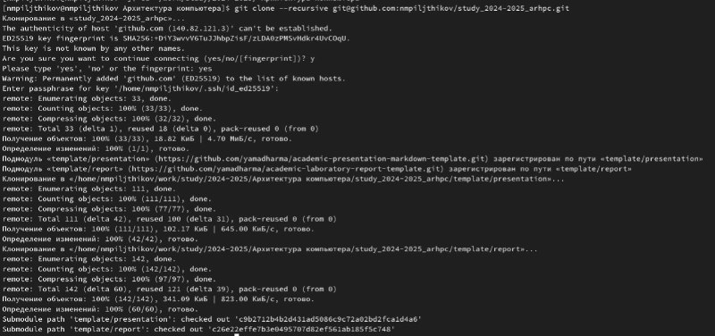
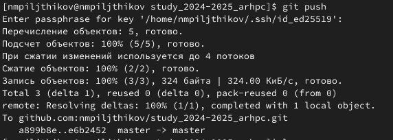

---
## Front matter
title: "Лабораторная работа №2"
subtitle: "Система контроля версий Git"
author: "Пильщиков Никита Максимович"

## Generic otions
lang: ru-RU
toc-title: "Содержание"

## Bibliography
bibliography: bib/cite.bib
csl: pandoc/csl/gost-r-7-0-5-2008-numeric.csl

## Pdf output format
toc: true # Table of contents
toc-depth: 2
lof: true # List of figures
lot: true # List of tables
fontsize: 12pt
linestretch: 1.5
papersize: a4
documentclass: scrreprt
## I18n polyglossia
polyglossia-lang:
  name: russian
  options:
	- spelling=modern
	- babelshorthands=true
polyglossia-otherlangs:
  name: english
## I18n babel
babel-lang: russian
babel-otherlangs: english
## Fonts
mainfont: IBM Plex Serif
romanfont: IBM Plex Serif
sansfont: IBM Plex Sans
monofont: IBM Plex Mono
mathfont: STIX Two Math
mainfontoptions: Ligatures=Common,Ligatures=TeX,Scale=0.94
romanfontoptions: Ligatures=Common,Ligatures=TeX,Scale=0.94
sansfontoptions: Ligatures=Common,Ligatures=TeX,Scale=MatchLowercase,Scale=0.94
monofontoptions: Scale=MatchLowercase,Scale=0.94,FakeStretch=0.9
mathfontoptions:
## Biblatex
biblatex: true
biblio-style: "gost-numeric"
biblatexoptions:
  - parentracker=true
  - backend=biber
  - hyperref=auto
  - language=auto
  - autolang=other*
  - citestyle=gost-numeric
## Pandoc-crossref LaTeX customization
figureTitle: "Рис."
tableTitle: "Таблица"
listingTitle: "Листинг"
lofTitle: "Список иллюстраций"
lotTitle: "Список таблиц"
lolTitle: "Листинги"
## Misc options
indent: true
header-includes:
  - \usepackage{indentfirst}
  - \usepackage{float} # keep figures where there are in the text
  - \floatplacement{figure}{H} # keep figures where there are in the text
---

# Цель работы

Целью работы является изучить идеологию и применение средств контроля версий. Приобрести практические навыки по работе с системой git.

# Задание

Зарегестрироваться на GitHub и создать свой репозиторий. Перенести все файлы с GitHub на компьютер.

# Выполнение лабораторной работы

Сначала сделаем предварительную конфигурацию git. Откройте терминал и введите следующие команды, указав имя и email владельца репозитория (рис. [-@fig:001]).

{#fig:001 width=70%}

Настроим utf-8 в выводе сообщений, а также зададим имя начальной ветки master.Далее дополним всё параметрами autocrlf и safecrlf (рис. [-@fig:002]).

{#fig:002 width=70%}

Сгенерируем SSh  ключ для индетификации пользователя на сервере репозиториев (рис. [-@fig:003]).

{#fig:003 width=70%}

С помощью команды cat ~/.ssh/id_rsa.pub | xclip -sel clip скопируем ключ в буфер обмена и вставим его в настройках  GitHub , предворительно назвав Title (рис. [-@fig:031]).

{#fig:003 width=70%}

Создаём репозиторий на сайте GitHub (рис. [-@fig:004]).

{#fig:004 width=70%}

Заходим в созданный ранее каталог ~/work/study/2024–2025/"Архитектура компьютера" и клонируем туда репозиторий с помощью команды git clone --recursive git@github.com:nmpiljthikov/study_2024-2025_arhpc.git (рис. [-@fig:005]).

{#fig:005 width=70%}

Переходим в  каталог из репозитория study_2024-2025_archpc и удаляем ненужные файлы (рис. [-@fig:006]).

{#fig:006 width=70%}

С помощью команды echo arch-pc > COURSE и make  создаём необходимые каталоги (рис. [-@fig:007]).

{#fig:007 width=70%}

Далее прописываем команды " git add ."; " git commit -am 'feat(main): make course structure'" ; "git push" для отправки данных в главный репозиторий (рис. [-@fig:008]).

{#fig:008 width=70%}

Создание основной структуры (рис. [-@fig:009]).

{#fig:009 width=70%}

Отправка данных в репозиторий (рис. [-@fig:010]).

{#fig:010 width=70%}

# Задания для самостоятельной работы

Скопируем предыдущую лабороторную работу № 1 в соотвествующий каталог  (рис. [-@fig:011])

{#fig:011 width=70%}

Создадим отчёт по лабороторной работе № 2  (рис. [-@fig:012])

{#fig:012 width=70%}

Проверим, чтобы файлы были загружены (рис. [-@fig:013])

{#fig:013 width=70%}

# Выводы

С помощью данной лабороторной работы смог научиться создавать репозитории GitHub, также изучил идеологию и применени средств контроля версий, приобрёл основные навыки работы с git
