---
## Front matter
title: "Отчёт по лабораторной работе №7"
subtitle: "Дисциплина: Архитектура компьютера"
author: "Пильщиков Никита Максимович"

## Generic otions
lang: ru-RU
toc-title: "Содержание"

## Bibliography
bibliography: bib/cite.bib
csl: pandoc/csl/gost-r-7-0-5-2008-numeric.csl

## Pdf output format
toc: true # Table of contents
toc-depth: 2
lof: true # List of figures
lot: true # List of tables
fontsize: 12pt
linestretch: 1.5
papersize: a4
documentclass: scrreprt
## I18n polyglossia
polyglossia-lang:
  name: russian
  options:
	- spelling=modern
	- babelshorthands=true
polyglossia-otherlangs:
  name: english
## I18n babel
babel-lang: russian
babel-otherlangs: english
## Fonts
mainfont: IBM Plex Serif
romanfont: IBM Plex Serif
sansfont: IBM Plex Sans
monofont: IBM Plex Mono
mathfont: STIX Two Math
mainfontoptions: Ligatures=Common,Ligatures=TeX,Scale=0.94
romanfontoptions: Ligatures=Common,Ligatures=TeX,Scale=0.94
sansfontoptions: Ligatures=Common,Ligatures=TeX,Scale=MatchLowercase,Scale=0.94
monofontoptions: Scale=MatchLowercase,Scale=0.94,FakeStretch=0.9
mathfontoptions:
## Biblatex
biblatex: true
biblio-style: "gost-numeric"
biblatexoptions:
  - parentracker=true
  - backend=biber
  - hyperref=auto
  - language=auto
  - autolang=other*
  - citestyle=gost-numeric
## Pandoc-crossref LaTeX customization
figureTitle: "Рис."
tableTitle: "Таблица"
listingTitle: "Листинг"
lofTitle: "Отчёт по лабораторной работе №7"
lotTitle: "Дисциплина: Архитектура компьютера"
lolTitle: "Пильщиков Никита Максимович"
## Misc options
indent: true
header-includes:
  - \usepackage{indentfirst}
  - \usepackage{float} # keep figures where there are in the text
  - \floatplacement{figure}{H} # keep figures where there are in the text
---

# Цель работы

Изучение команд условного и безусловного переходов. Приобретение навыков написания
программ с использованием переходов. Знакомство с назначением и структурой файла
листинга.

# Задание

Разобраться в командах передачи управления или команды условного и безусловного перехода

# Выполнение лабораторной работы

Так как у меня уже есть созданный катлог lab07 перехожу в него и создаю текстовый файл, ввожу в него текст команды из листинга (рис. [-@fig:01]).

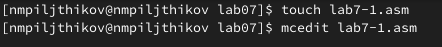{#fig:01 width=70%}

Текст из листинга (рис. [-@fig:02]).

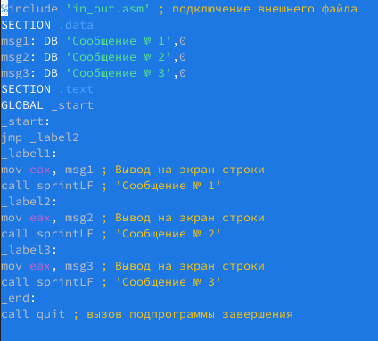{#fig:02 width=70%}

Создаю исполняемый файл и проверяю его работу (рис. [-@fig:03]).

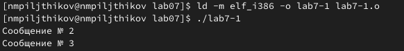{#fig:03 width=70%}

Меняю текст программы так, чтобы она сначала выводила второе сообщение, затем первое (рис. [-@fig:04]).

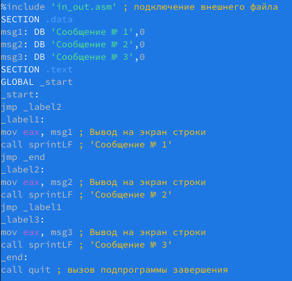{#fig:04 width=70%}

Создадим и запустим исполняемый файл для проверки правильности выполнения (рис. [-@fig:05]).

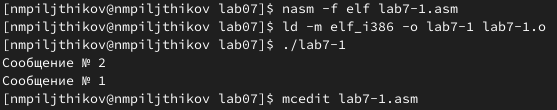{#fig:05 width=70%}

Изменим код   так, чтобы программа  выводила все три сообщения, но в обратном порядке (рис. [-@fig:06]).

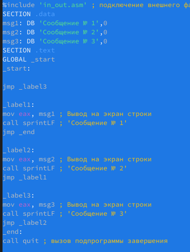{#fig:06 width=70%}

Проверим правильность, создав и запустив исполняемый файл (рис. [-@fig:07]).

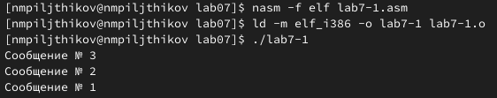{#fig:07 width=70%}

Создаю файл lab7-2 и ввожу в него указанный текст программы (рис. [-@fig:08])

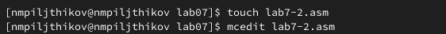{#fig:08 width=70%}

Ввод текста из листинга (рис. [-@fig:09])

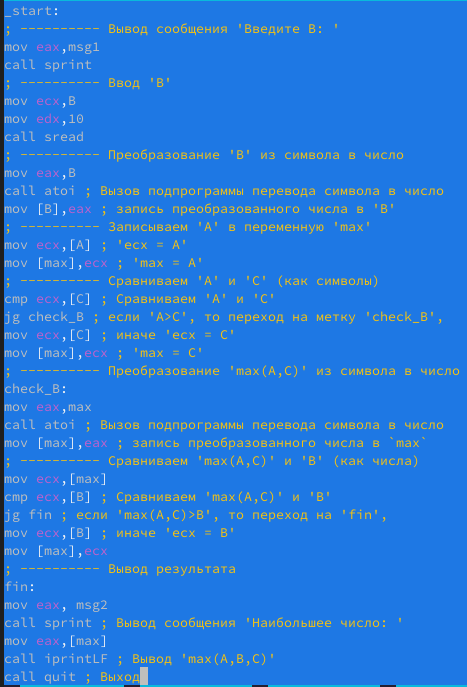{#fig:09 width=70%}

Проверка исполнения на разных переменных В (рис. [-@fig:010]).

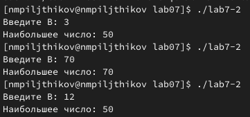{#fig:010 width=70%}

#Изучение структуры файлов листинга

Создаю файл листинга для программы из файла lab7-2.asm  (рис. [-@fig:011]).

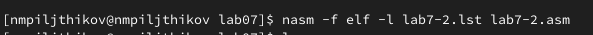{#fig:011 width=70%}

Ознакомлюсь с файлом и детально изучу три его строчки.
Сперва рассмотрю строчку под номером 5, её адрес - 00000001, машинный код - 89С3, а mov ebx,eax - пересылает значение
регистра ebx в регистр eax (рис. [-@fig:012]).

{#fig:012 width=70%}

Рассмотрим вторую строку под номером 33. В данной строчке 0000001D - её адрес, BB01000000 - её машинный код, а mov ebx,1 - пишет в регистр ebx
значение 1 (рис. [-@fig:013]).

{#fig:013 width=70%}

Рассмотри третью строчку. Здесь 00000008 - адрес строки, 40 - машинный код, inc ebx - увеличивает значение операнда ebx на 1 (рис. [-@fig:014]).

{#fig:014 width=70%} 

Открываю файл программы и убираю операнд max (рис. [-@fig:015]).

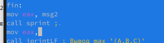{#fig:015 width=70%}

Пытаюсь скомпилировать и запустить файл листинга, проверим какие файлы создались (рис. [-@fig:016]).

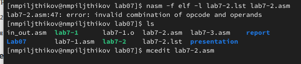{#fig:016 width=70%}

Откроем файл lab7-2.lst и проверим, как выглядит наш код, что именно изменилось (рис. [-@fig:0161]).

{#fig:0161 width=70%}

Под тем местом, где мы удалили операнд высветилась наша ошибка

#Задания для самостоятельной работы

Напишем программу, которая из 3 целачисленных значений выберет наименьшее "значения я буду подставялть из 6 варианта листинга в соотвествии с лабораторной №6" (рисю [-@fig:017]).

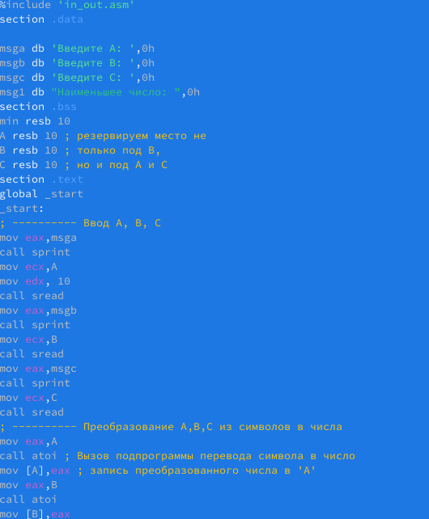{#fig:017 width=70%}

Проверим правильное функцианирование нашей программы (рис. [-@fig:018]).

{#fig:018 width=70%}

Убедившись в правильной работе своей программы, создаю новую. Создам программу, которая решает заданную функцию(Вариант 6) (рис. [-@fig:019]).

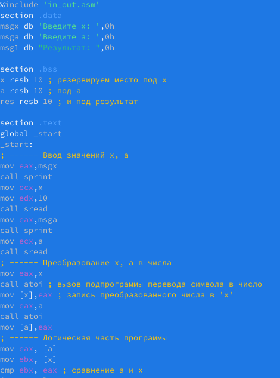{#fig:019 width=70%}

Убедимся в верном написании программы, подставив заданные переменные (рис. [-@fig:020]).

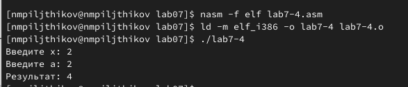{#fig:020 width=70%}

Обязательно проверим работу программы для вторых переменных (рис. [-@fig:021]).

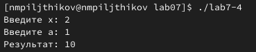{#fig:021 width=70%}

Отлично, программа работает без ошибок, ответ получен верный.

# Выводы

В ходе выполнения лабораторной работы я изучил команды условного и без-
условного переходов, а также приобрел навыки написания программ с использо-
ванием переходов, познакомилась с назначением и структурой файла листинга.

