---
## Front matter
title: "Лабораторная работа №8"
subtitle: "Программирование цикла. Обработка аргументов командной строки."
author: "Пильщиков Никита Максимович"

## Generic otions
lang: ru-RU
toc-title: "Содержание"

## Bibliography
bibliography: bib/cite.bib
csl: pandoc/csl/gost-r-7-0-5-2008-numeric.csl

## Pdf output format
toc: true # Table of contents
toc-depth: 2
lof: true # List of figures
lot: true # List of tables
fontsize: 12pt
linestretch: 1.5
papersize: a4
documentclass: scrreprt
## I18n polyglossia
polyglossia-lang:
  name: russian
  options:
	- spelling=modern
	- babelshorthands=true
polyglossia-otherlangs:
  name: english
## I18n babel
babel-lang: russian
babel-otherlangs: english
## Fonts
mainfont: IBM Plex Serif
romanfont: IBM Plex Serif
sansfont: IBM Plex Sans
monofont: IBM Plex Mono
mathfont: STIX Two Math
mainfontoptions: Ligatures=Common,Ligatures=TeX,Scale=0.94
romanfontoptions: Ligatures=Common,Ligatures=TeX,Scale=0.94
sansfontoptions: Ligatures=Common,Ligatures=TeX,Scale=MatchLowercase,Scale=0.94
monofontoptions: Scale=MatchLowercase,Scale=0.94,FakeStretch=0.9
mathfontoptions:
## Biblatex
biblatex: true
biblio-style: "gost-numeric"
biblatexoptions:
  - parentracker=true
  - backend=biber
  - hyperref=auto
  - language=auto
  - autolang=other*
  - citestyle=gost-numeric
## Pandoc-crossref LaTeX customization
figureTitle: "Рис."
tableTitle: "Таблица"
listingTitle: "Листинг"
lofTitle: "Список иллюстраций"
lotTitle: "Список таблиц"
lolTitle: "Листинги"
## Misc options
indent: true
header-includes:
  - \usepackage{indentfirst}
  - \usepackage{float} # keep figures where there are in the text
  - \floatplacement{figure}{H} # keep figures where there are in the text
---

# Цель работы

Приобретение навыков написания программ с использованием циклов и обработкой
аргументов командной строки.

# Задание

Разобраться в организации стека. Научиться добавлять в стек, извлекать из стека.

# Выполнение лабораторной работы

Зайдём в каталог lab08, созданный ещё при выполнении лабораторной №2, и создадим в нём файл lab8-1.asm с помощью команды touch. Далее отредактируем его в текстовом редакторе mcedit, подставив текст из листинга 8.1 (рис. [-@fig:001]).

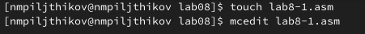{#fig:001 width=70%}

Редактируем текст программ с помощью листинга 8.1 (рис. [-@fig:002]).

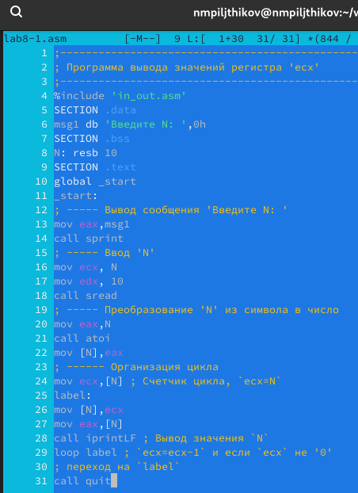{#fig:002 width=70%}

Создаём и запускаем исполняемый файл.Проверяем результат (рис. [-@fig:003]).

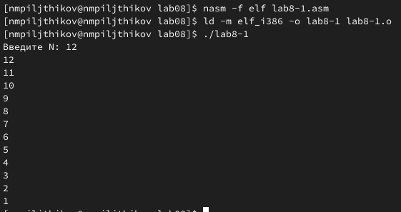{#fig:003 width=70%}

Редактирую текст программы добавив изменение значение регистра ecx в цикле (рис. [-@fig:004]).

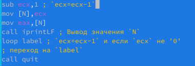{#fig:004 width=70%}

Создаю и запускайю исполняемый файл (рис. [-@fig:005]).

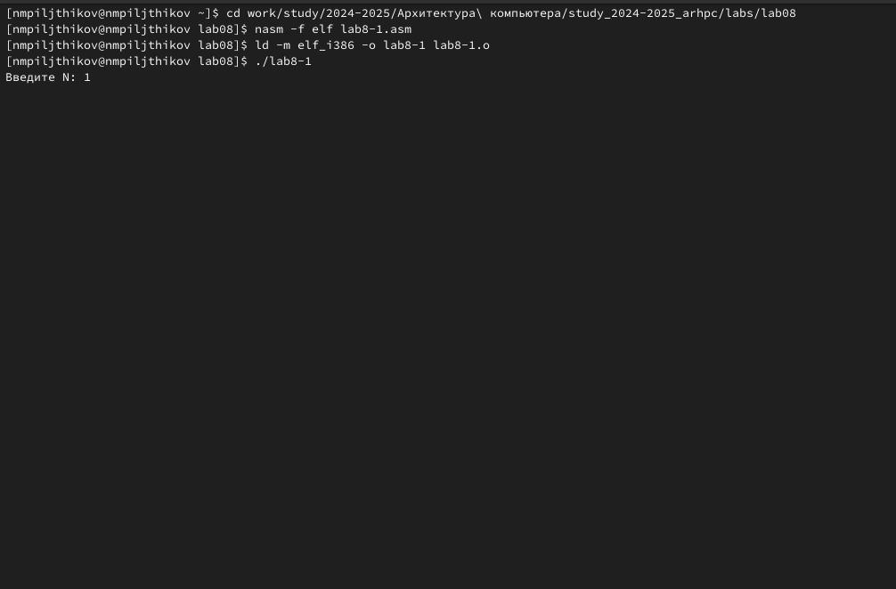{#fig:005 width=70%}

Запустив программу, та стала выдавать бесконечный цикл (рис. [-@fig:006]).

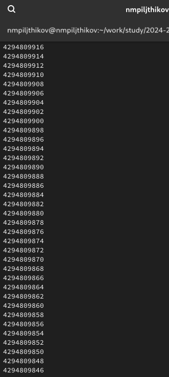{#fig:006 width=70%}

Вношу изменения в текст программы, добавив команды push и pop для сохранения значения счетчика цикла loop (рис. [-@fig:007]).

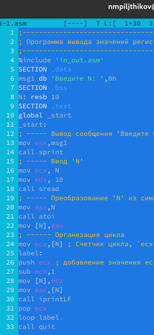{#fig:007 width=70%}

Создам и запущу исполняемый файл (рис. [-@fig:008]).

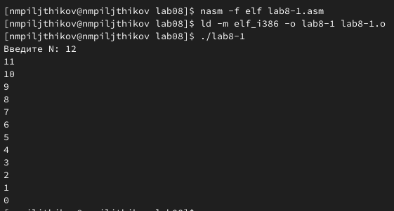{#fig:008 width=70%}

Теперь число проходов цикла соответствует значению, введённому с клавиатуры.Создам файл lab8-2.asm, также, как и создавался lab8-1.asm, внесём в него текст из листинга 8.2 (рис. [-@fig:009]).

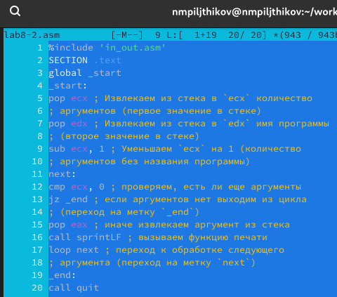{#fig:009 width=70%}

Создание исполняемого файла, и его последующий запуск с аргументом 1, аргументом 2, аргументом 3 (рис. [-@fig:010]).

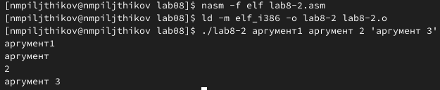{#fig:010 width=70%}

Команда обработала 4 аргумента, так как  "аргумент" и "2" считаются разными аргументами, потому что  между ними стоит пробел. Создаю файл lab8-3.asm для следующей программы и сразу вношу него текст программы (рис. [-@fig:011]).

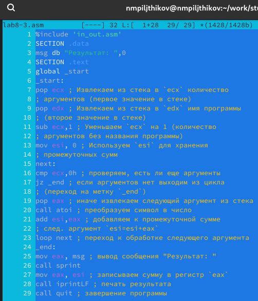{#fig:011 width=70%}

Создаю и запускаю исполняемый файл с аргументами: 13 14 8 11 6.Результат работы программы. Сумма аргументов командной строки
13+14+8+11+6=52. Это совпадает с результатом программы, следовательно она работает правильно (рис. [-@fig:012]).

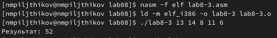{#fig:012 width=70%}

Изменяю текст программы lab8-3.asm для вычисления произведения аргументов командной строки (рис. [-@fig:013]).

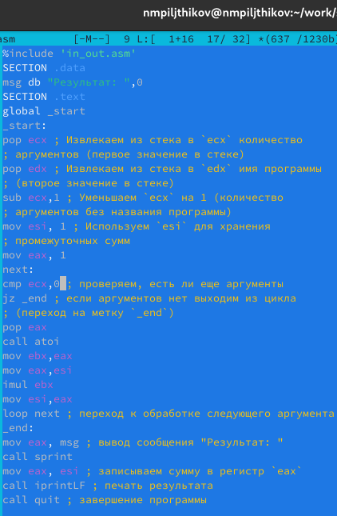{#fig:013 width=70%}

Запустим созданный мною исполняемый файл и убедимся в том, что всё работает правильно (рис. [-@fig:014]).

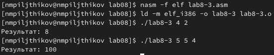{#fig:014 width=70%}

Программа работает верно. При аргументах 4 и 2 программа выдаёт ответ умножения 8, а при подставлении 5 5 4 - ответ 100, следовательно умножение выполнено правильно.

#Самостоятельная работа

Создаю файл lab8-4.asm  и ввожу текст программы для вычисления суммы функций вида f(x)=4x-3. Выполнение самостоятельного задание ведётся в соотвествии с вариантом № 6, полученным из лабороторной № 7 (рис. [-@fig:015]).

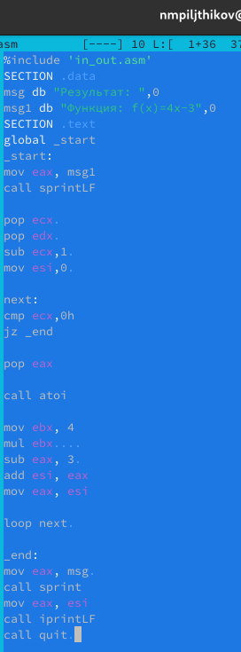{#fig:015 width=70%}

Далее запустим исполняемый файл программы и подставим разные аргументы (рис. [-@fig:016]).

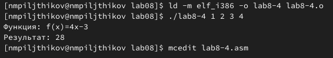{#fig:016 width=70%}

Ответ получен верный, программа работает правильно.

# Выводы

Я приобрёл  навыки написания программ с использованием циклов и обра-
боткой аргументов командной строки, а также разобрался в организации стека. Научился добавлять в стек, извлекать из стека.
